# System Alpha & Bravo

This is an example system that it used to demonstrate different architectural approaches as they relate to scalability. Its core functions are the following:

- The system shall allow a user to add documents
- The system shall version documents
- The system shall allow a user to download a document

This specific implementation is intended to demontrates the the Alpha and Bravo variations on the path to scalability:

## Alpha

Reference: https://github.com/jvalentino/clothes-closet-wiki#single-server-rating-a-dozen

**Single Server (Rating: a dozen)**

There was no concept of separation of front-end and backend, and server-side scripting technologies would handle both aspects. Specificaly when a browser would make a request for a page, the backend would handle dynamically generating the HTML content for the browser as a part of that one request. Generally, we would do this all on a single server:

[](https://github.com/jvalentino/clothes-closet-wiki/blob/main/wiki/step-1.png)

Pros

- None

Cons

- No separation between front-end and backend.
- Resource contention between backend and database.
- Session is maintained in server-memory, thus limiting the number of concurrent users.
- A single user facing server, thus concurrent load is highly limited.
- The more data that goes into the database, the slower it performs.
- Core reliance on RDMS limits upper scalability.

## Bravo

Reference: https://github.com/jvalentino/clothes-closet-wiki#dedicated-database-server-rating-dozens

**Dedicated Database Server (Rating: dozens)**

Obviously with both the backend and the database on the same server, resource contention was high. This made the first obvious step to move the data persitence onto its own server:

[](https://github.com/jvalentino/clothes-closet-wiki/blob/main/wiki/step-2.png)

Pros

- Backend and Database independent, allowing us have different optimized servers.

Cons

- No separation between front-end and backend.
- Incentivizes a snowflake architecture by having to fine tune the server hardware differently.
- Session is maintained in server-memory, thus limiting the number of concurrent users.
- A single user facing server, thus concurrent load is highly limited.
- The more data that goes into the database, the slower it performs.
- Core reliance on RDMS limits upper scalability.

# Architecture

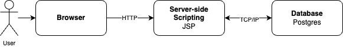

The implemenation in this context ignores the separation between dedicated servers for server-side scripting and database, and assumes that as a deployment detail. There is nothing limiting this separation, so we are assuming the Bravo reference architecture, though for demonstration purposes we are running everhything locally on the same machine.

Specifically this example makes use of:

1. Using [Spring Boot](https://github.com/jvalentino/glossary#spring-boot) as the underlying framework
2. Using [JSP](https://github.com/jvalentino/glossary#jsp) per an embedded Tomcat Container
3. Using [Spring MVC](https://github.com/jvalentino/glossary#spring-mvc) for the  [MVC](https://github.com/jvalentino/glossary#mvc-design-pattern) design pattern
4. Using [JPA](https://github.com/jvalentino/glossary#jpa) as a means of supporting the [DAO Pattern](https://github.com/jvalentino/glossary#dao-design-pattern)
5. Using [liquidbase](https://github.com/jvalentino/glossary#liquibase) for database change management
6. Using [Postgres](https://github.com/jvalentino/glossary#postgres) for the underlying database
7. Using an [H2](https://github.com/jvalentino/glossary#h2) database for service/integration test automation
8. Using [Spring Boot Test](https://github.com/jvalentino/glossary#spring-boot-test) as the service/integration testing framework
9. Using [Spock](https://github.com/jvalentino/glossary#spock) for the underlying test automation framework

"That's a lot of frameworks."

Yes, welcome to modern software development. The reasoning is that if you were to try and write every actual line of code required for building this system without fameworks, that amount of code and complexity would greatly dwarf the code unique to the system. Some easy examples:

- I am not going to write my own socket-server layer for handle HTTP communication, I am going to use [Spring Boot.](https://github.com/jvalentino/glossary#spring-boot)
- I am not doing to write my own code for turning Objects into SQL queries for Create, Read, Update, and Delete, I am gong to use JPA.
- I am not going to build my own framework for knowing when database update scripts need to be applied, I am going to use liquibase.

Every framework has a purpose for making things easier. However, the downside is something I call "magic", because the path for how functionality executes is not always as clear (as you didn't write it). Google is your friend; Google the error message.

## Common Patterns

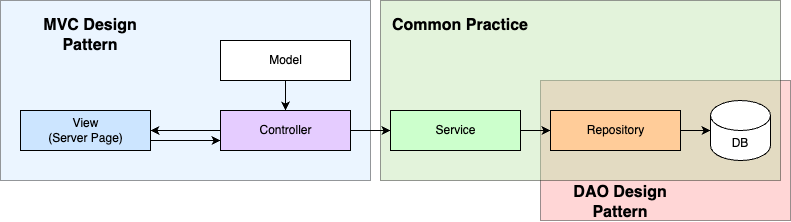

A commom practice when going server-side scripting is to use the [MVC Pattern](https://github.com/jvalentino/glossary#mvc-design-pattern). This is done to help separate code by function, and in the case of your JSP-based technology stack, that means:

1. The View is always the [JSP](https://github.com/jvalentino/glossary#jsp)
2. The Controller is the point of entry at the HTTP Request level
3. The Model is a standalone representation of the data the page needs to turn into HTML

Since we are interacting with a database for data persistence, it is best to use the [DAO Pattern](https://github.com/jvalentino/glossary#dao-design-pattern) to deal with that interation. Spring a Spring Boot perspective, it is common to add in a service layer to manage the different DAO related classed, typically called Repositories.

## Implementation

Normally I would not draw a [Sequence Diagram](https://github.com/jvalentino/glossary#sequence-diagram), as I tend to only use them as either a teaching tool or for rervese engineering something which is so complex that I can't easily figure it out by looking at the code. The following diagram describes how every aspect of this system works at the endpoint and method level:

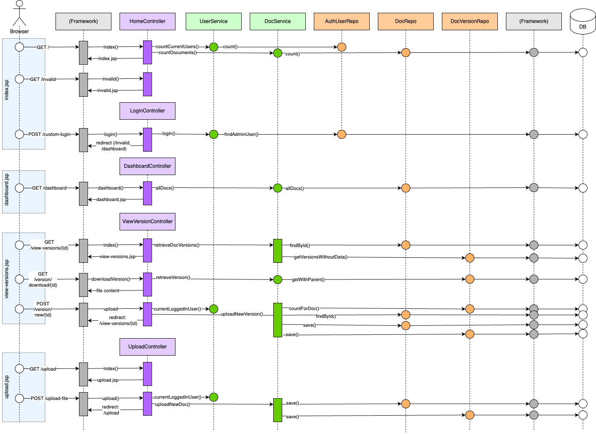

The important takeaway is the layering:

- The browser's experience is the result of the various JSP files that have their HTML content generated server-side and then provided to that browser.
- There is a framework layer that handles runing HTTP endpoints into individual method level calls in the various controller classes.
- Controllers invoke Service classes to perform the needed operations.
- Services invoke Repositories classes in order to interact with the underyling database.
- There is a framework that handles translating that Repository layer into actual database operations.

# User Experience

A pretty UI is not the purpose of this example, nor is exhaustive functionality. The intention here is to show how all the different layers and patterns come together to form an architecture for hosting a working system.

## / (home.jsp)

The initial page, which displays some general information about how many users and documents there are, with also giving the components needed for login.

Note that the system on startup will automatically create an admin user if it does not exist, and print the new password to the console.

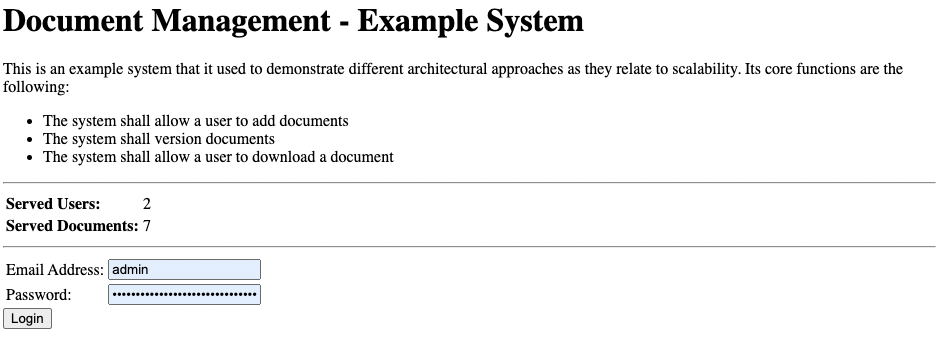

## /dashboard (dashboard.jsp)

After logging in, this pages displays all the currently uploaded documents, where you can then click to view/download the various versions.

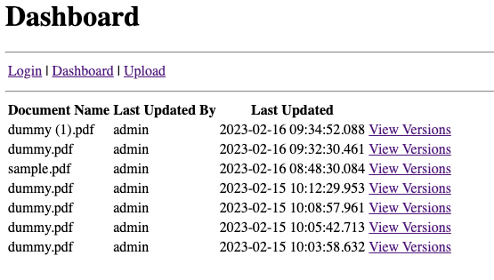

## /upload (upload.jsp)

This page is used for uploading a new document, which results in a new document as version 1 within the system.

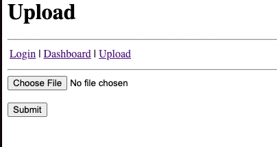

## /view-versions (view-versions.jsp)

This page lists all of the individual versions that were uploaded for a document, as well as for uploading a new version.

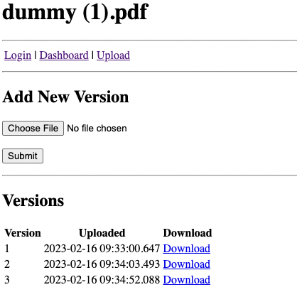

# Developer

Prerequisites

- Java
- IntelliJ
- Docker
- Docker Compose
- pgadmin
- Git

All of these you can get in one command using this installation automation (if you are on a Mac): https://github.com/jvalentino/setup-automation

## Database

You launch the database container by running:

```bash
docker compose up -d
```

This sill execute the container in detetached mode, and leave it running in the background.

You then have to manually create a database name `examplesys`, which is most easilly done via pgadmin:

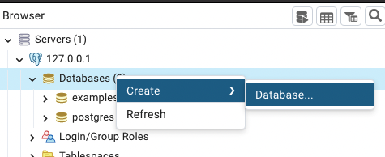

## IDE Testing

This imports as a standard Gradle project, in which you are able to easily execute tests:

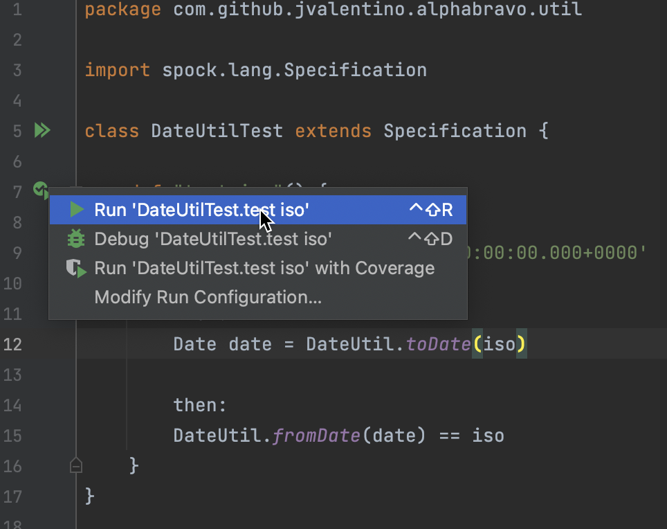

## Runtime

However, running this thing requires an embedded Tomcat container, which I could only get working via the Gradle Plugin, which means I had to setup a Gradle task to run `tomcatRunWar`:

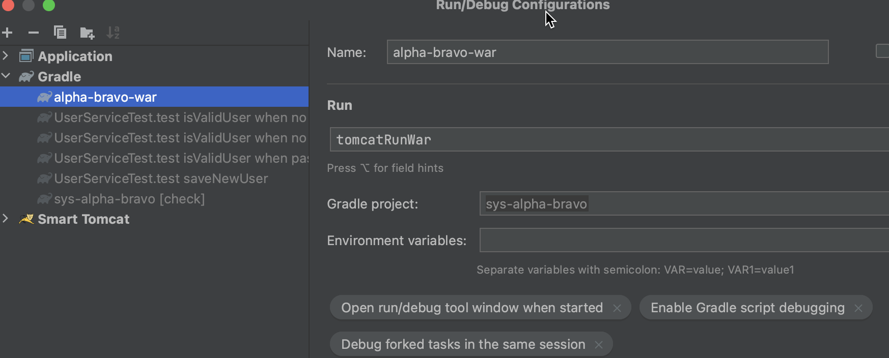

IT doesn't shutdown nicely, to be prepared to run this command over and over again to kill it: `pkill -f tomcat`

You can otherwise do this at the command-line using `./gradlew tomcatRunWar`

## Verification

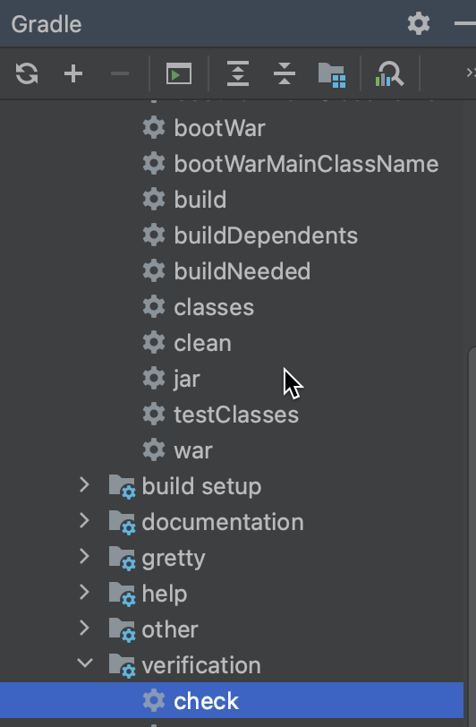

Running check will execute both testing and static code analysis via the build.

This is otherwise the same as doing this at the command-line: `./gradlew check`

## Strategy

Codenarc is used to ensure that no common coding issues can be added.

Jacoco is used to enforce that line coverage is over 85%.

Tests that end in "IntgTest" are used for integration testing via Spring Boot Test, otherwise they are unit tests.

Every code commit triggers a Github Action pipeline that runs the entire build process.